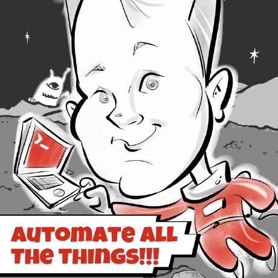

## Hi

My name is David. I'm an independent app developer. I've personally struggled with digital addiction and focus for years. Digital Carrot started as a dumb Python script running on my computer that would read data from my Garmin Smart watch and block youtube until I either worked out on my rowing machine or went for a walk. It was so effective that I decided it was something worth sharing with the world.

Digital Carrot is a passion project of mine. I've had an amazing time building it and it has been great to see the ways that it has helped so many people out there! My hope is that I can turn this app into a full time job. To that end, I would like to thank everyone who has supported my work financially via in app purchases! I've got big plans for this app, and your support goes a long way towards making them happen ❤️.

If you're interested in my other projects, I've recently started a blog: [davidsobsessions.com](https://www.davidsobsessions.com)
