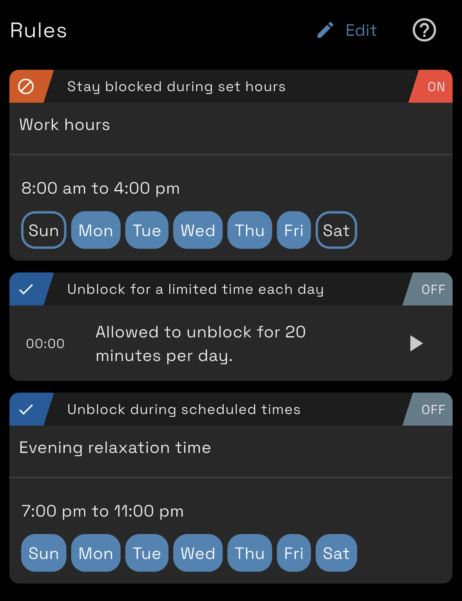

 

Digital Carrot 1.5 is now available for download and has a whole slew of improvements to the UI.

<!--more-->

## Plugin Widgets

Widgets allow for plugin authors to add some extra intractability to their plugins. We've added widgets to:

- Manual goals. You can now toggle a goal as completed or not with a single tap.
- Timers: Timers can be toggled on and off from the home screen and now show progress in realtime
- Todoist and Reminders: You can see which items are due in Digital Carrot without having to leave the app.

## Pinned Widgets

The new plugin widgets as well as your weekly progress graphs and streaks can now be pinned to the home screen.


  
  


## Rules

Always block and never block rules have been simplified into just rules. A rule can either cause your block list to block or unblock depending on the type of rule.

