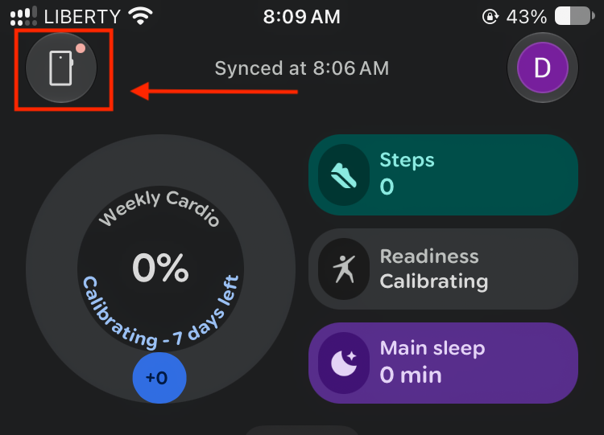
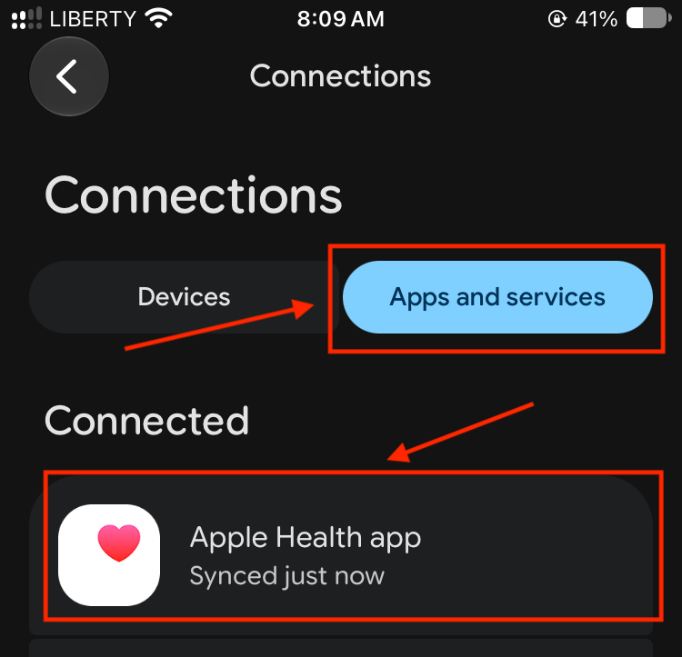
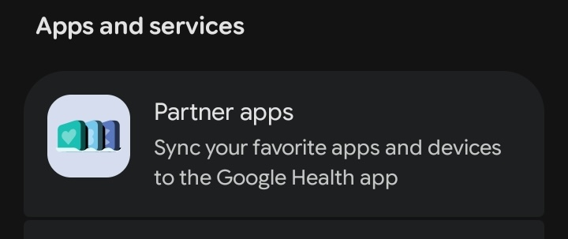
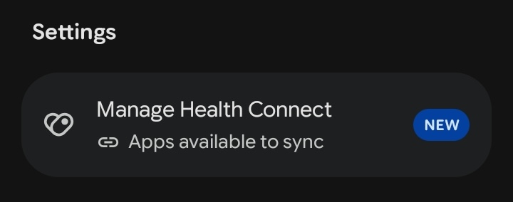
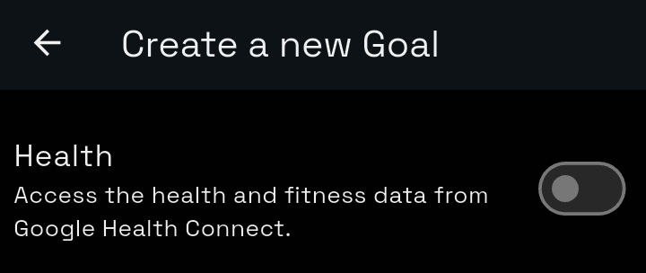

 

Google is shutting down the web APIs that the Digital Carrot Fitbit plugin relies on as of
September 30th, 2026.

<!--more-->

The iOS Fitbit app did not originally support Apple Health when Digital Carrot launched back
at the start of 2026. Because of this, I ended up writing a plugin that used the Fitbit web
APIs in order to support health data for Fitbit users. Since then Google has begun the [time
honored tradition](https://killedbygoogle.com/) of killing off Fitbit and replacing it with
Google Health. As a result, the Fitbit plugin is now broken and Fitbit users will need to
re-recreate their goals using the default plugin.

## How to Migrate your Fitbit Goals

> [!WARNING] Fitbit is no longer available on PC
> Fitbit data can still be accessed through Apple Health on iPhone and Health Connect on
> Android, but is no longer available on PC. You can still access your health goals on PC
> with sync.

{}

### Download Google Health

The [Google Health app](https://www.healthapp.google/) is available on iPhone and Android.
It has replaced the old Fitbit app and supports syncing health data with Apple Health and
Android Health Connect.

### Set up Google Health

Tap the icon in the upper left corner to connect new devices.

**On iPhone**

1. Tap "Apps and services" under "Connections"
2. Tap "Apple Health app" to connect to Apple Health.

> [!NOTE]
> You don't need to share all of your Apple Health data with Google. Granting Google Health permission
> to only write to Apple Health is sufficient for Digital Carrot.

**On Android**

1. Tap "Partner Apps"

2. Tap "Manage Health Connect" to share health data with other apps

### Create a new Goal

Create a new health goal in Digital Carrot. If the app tells you to use the Fitbit Plugin when
you select your fitness tracker, go back and pick "Other Fitness Trackers". Older versions of
the app will still prompt you to use the Fitbit plugin.

{}
