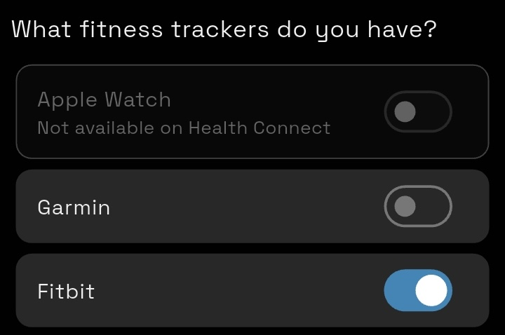

 

Google is shutting down the web APIs that the Digital Carrot Fitbit plugin relies on as of
September 30th, 2026.

<!--more-->

The iOS Fitbit app did not originally support Apple Health when Digital Carrot launched back
at the start of 2026. Because of this, I ended up writing a plugin that used the Fitbit web
APIs in order to support health data for Fitbit users. Since then Google has begun the [time
honored tradition](https://killedbygoogle.com/) of killing off Fitbit and replacing it with
Google Health. As a result, the Fitbit plugin is now broken and Fitbit users will need to
re-recreate their goals using the default plugin.

## How to Migrate your Fitbit Goals

> [!IMPORTANT] Update Digital Carrot
> Make sure you're on the latest version of Digital Carrot (1.7.1). You can still set up
> goals for Fitbit in the older version of the app, but it will instruct you to use the
> Fitbit plugin.

The good news here is that the new Google Health app that [everyone loves so much](https://kotaku.com/google-fitbit-app-health-new-update-ai-filled-version-and-everybody-is-mad-2000699806)
finally supports Apple Health! You can set it up by creating a new health goal. 

Select the Fitbit option from the list:

## Troubleshooting

If you aren't seeing your Fitbit data show up in the app do the following:

- On Android: go to Settings > System Capabilities > Google Health Connect 
- On iOS: go to Settings > System Capabilities > Apple Health
- Ensure that the health capability is running. If you don't see Fitbit under "My
  Fitness Trackers", click "Update" to add it.
