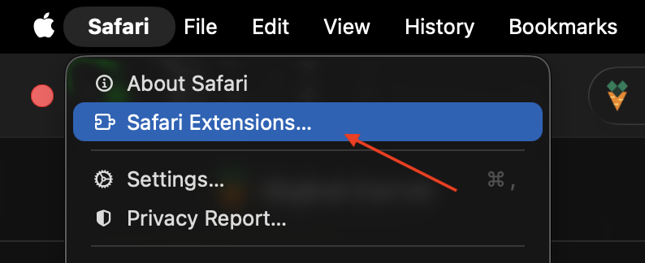
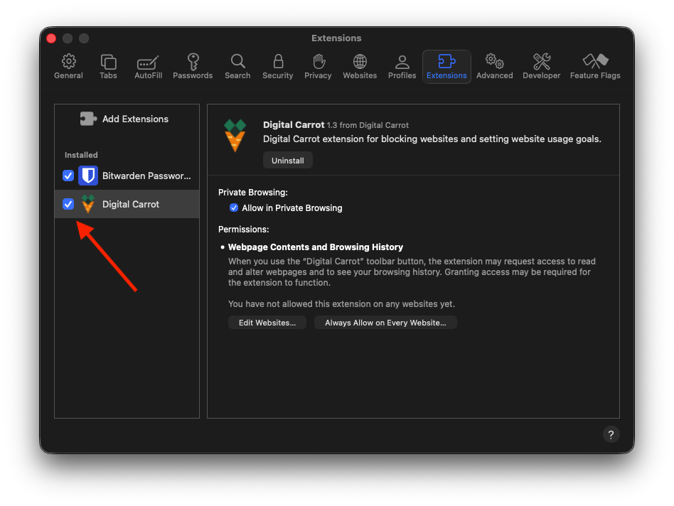
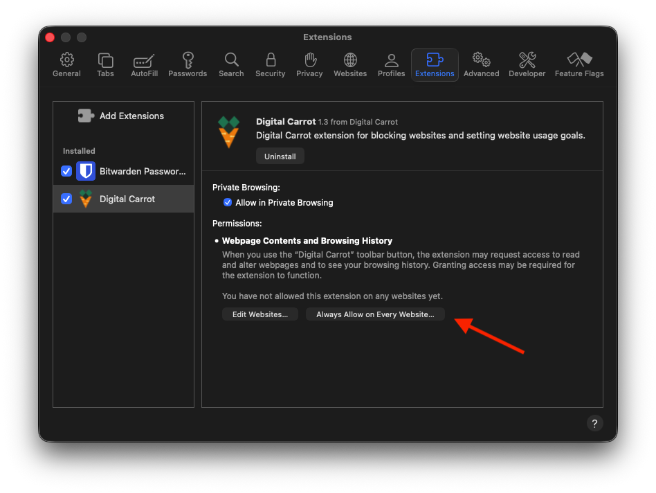
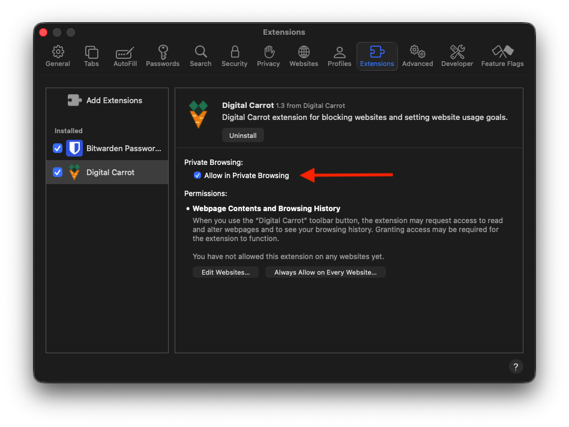

> [!NOTE]
> Digital Carrot needs to access all pages to be able to function properly.

{}

### Open up Safari Extensions

Open extension settings from Safari > Safari Extensions.

### Enable the Digital Carrot Extension

Make sure the Digital Carrot Extension is checked.

### Grant Access to view Websites

Click "Always Allow on Every Website..." and grant permissions to view all sites.

### Allow Private Browsing

Make sure "Allow in Private Browsing" is checked.

{}

All data collected by the browser extension is fully private. [Check out our privacy policy for more information.](/docs/privacy_policy/)
