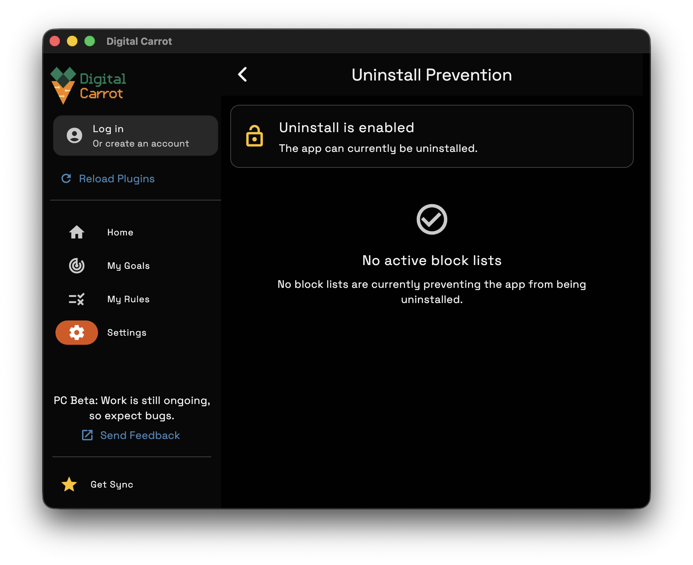

## Whoopsie

Looks like you tried to uninstall the Mac App while uninstall prevention was active.

You'll need to [re-download](/download) the app in order to fully uninstall it.

If you want to fully uninstall Digital Carrot make sure you do the following:

1. Ensure that all of your blocklists are unblocked.
2. Disable commitment mode on all of your blocklists.

Once you do that, go to Settings > Uninstall to see if uninstall protection is disabled.

