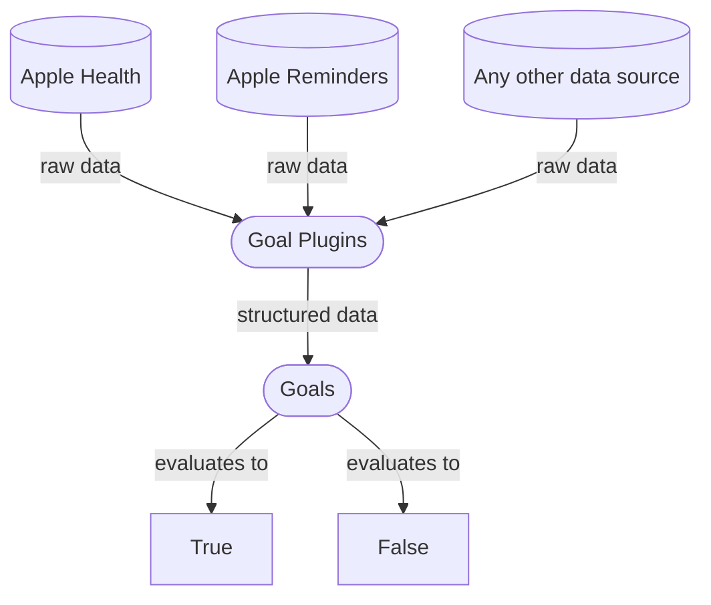

## Goals

At the heart of Digital Carrot are Goals. Goals are [expr expressions](https://expr-lang.org/) that ingest your data and evaluate to either `true` or `false`. The data available to these expressions are provided by Goal Plugins. Goal Plugins interface with external data sources such as Apple Health and Reminders to fetch data and structure it so that it is easy to work with.

## Block Lists

Block Lists contain the following components:

- A set of goals
- A list of things to block
- A pause date
- Commitment Plugins

### Evaluating Goals

The goals in a Block List can be arranged so that every goal must be met for the Block List to unlock, or so that only a single goal is required. These list of goals are combined into a single large boolean statement which will either evaluate to `true` or `false`. Once this statement evaluates to `true` the block is lifted for the day.

Example: Lets say you have the following block list:

For this list to unblock you will need to accomplish `A` and `B` and EITHER `C` or `D`.

### Blocked Items

If the list of goals is completed, the Block List's pause date will be set to some point in the future (this defaults to 2am the next day, but is configurable) and all of the items blocked by the list will now be accessible.

Block Lists are read by Enforcement Plugins. These plugins will read the list of configured items from the Block List and decide whether or not to allow them based on the list's pause date. If the pause date is in the future, then any items on the list will be allowed. Otherwise they will be blocked.

### Commitment Plugins

Block Lists can be locked to prevent users from changing them. We don't want to permanently lock user's out of their devices, so locking a list requires adding a Commitment Plugin. Commitment Plugins provide a way for the user to make changes to their list of goals if they need to. They work by issuing a challenge to the user. If the user can successfully complete the challenge, then the Block List is allowed to be modified.
